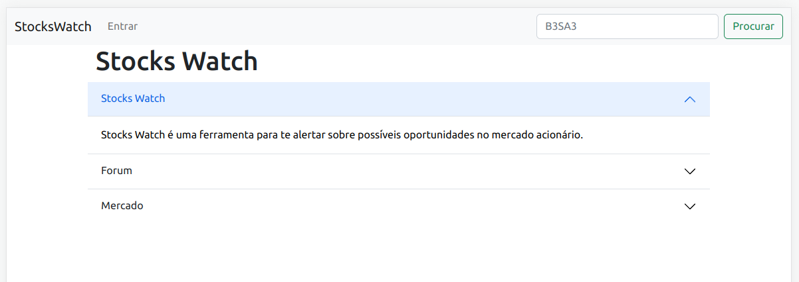

# [Desafio Alpha](https://github.com/surtarso/Python-Projects/tree/main/Desafio%20Alpha%20-%20StocksWatch/StocksWatch)

  - Obter periodicamente as cotações de alguma fonte pública qualquer e armazená-las, em uma periodicidade configurável para cada túnel, para consulta posterior
  - Expor uma interface web para permitir consultar os preços armazenados, configurar os ativos a serem monitorados e parametrizar os túneis de preço de cada ativo e periodicidade da checagem de cada ativo
  - Enviar e-mail para o investidor sugerindo Compra sempre que o preço de um ativo monitorado cruzar o seu limite inferior, e sugerindo Venda sempre que o preço de um ativo monitorado cruzar o seu limite superior
  - Traduzir o conceito para Django.
## Projeto:
  - [StocksWatch](https://github.com/surtarso/Python-Projects/tree/main/Desafio%20Alpha%20-%20StocksWatch/StocksWatch)
  

## Conceito:
  - [*Stocks_App_Concept.py*](Stocks_App_Concept.py)
    - Procurar preço de ativos: yfinance e yahoo-fin
    - Setar preço compra/venda e duração da operação
    - Mandar e-mails em preços atingidos: console mail

  - [*graph_generation_tests.py*](graph_generation_tests.py)
    - Gera gráficos com plotly e yfinance

