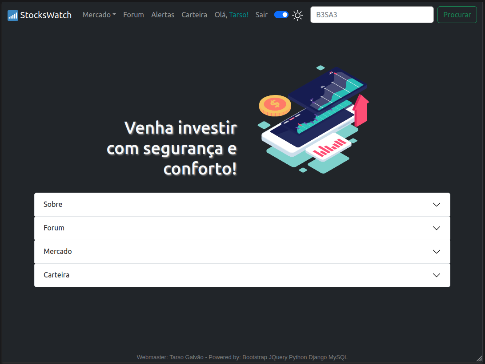
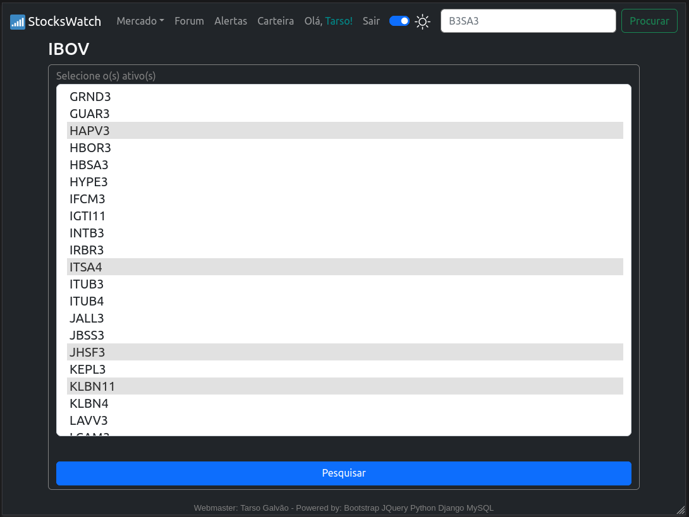
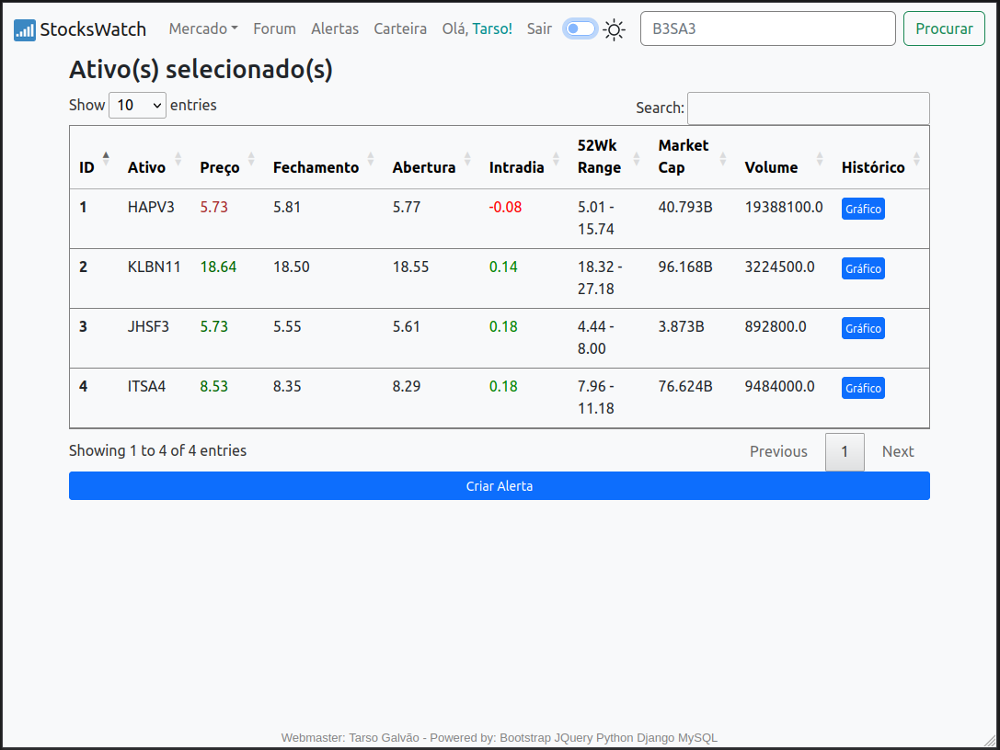
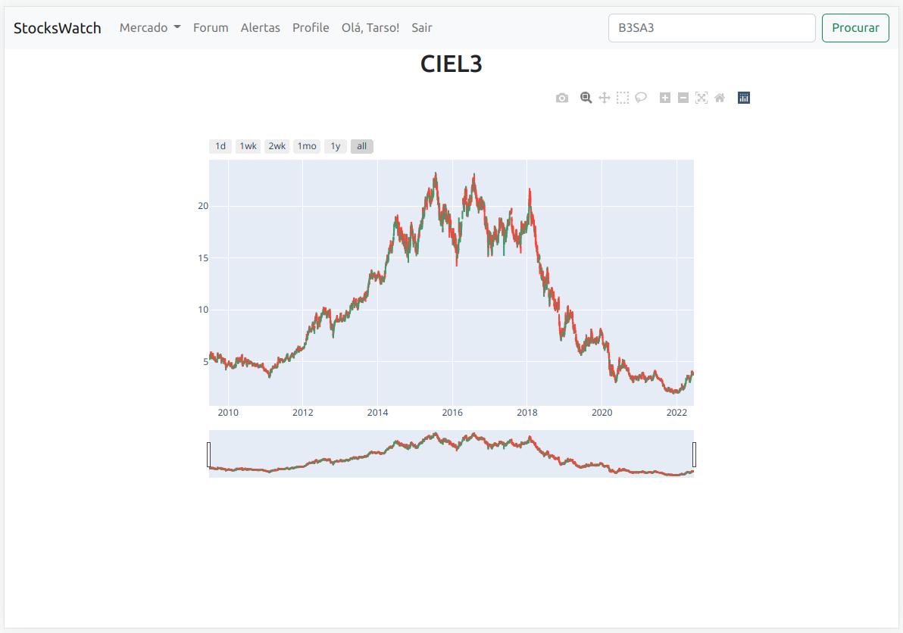
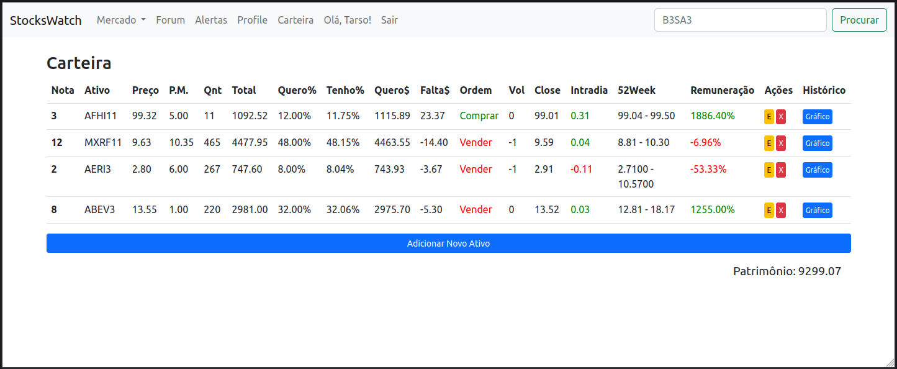
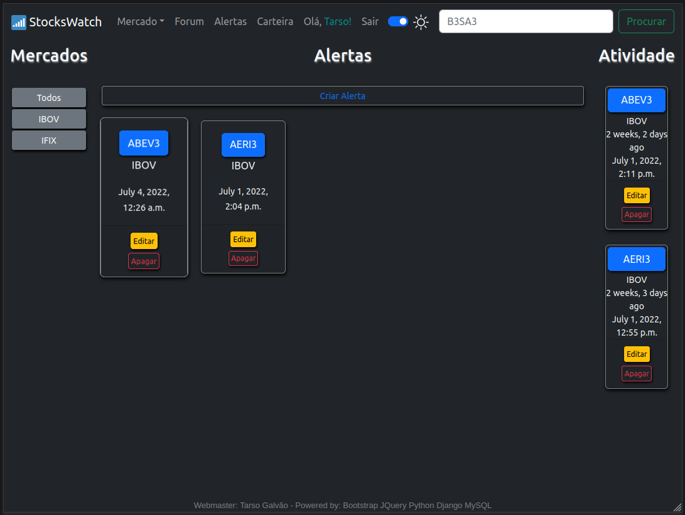
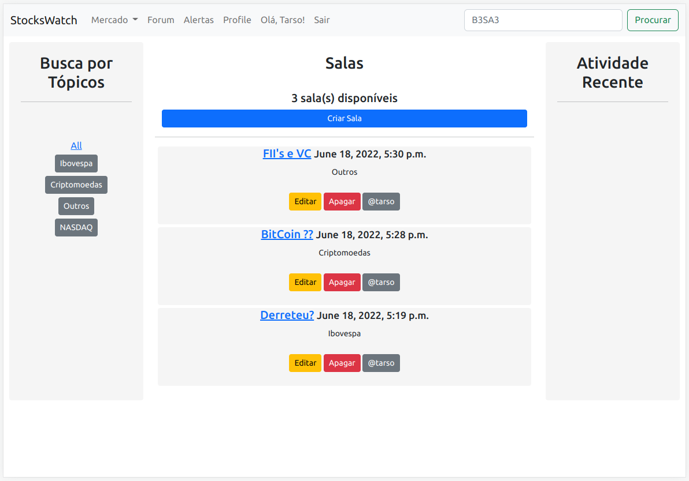

# StocksWatch em Python / Django!

<h5>Home Page:</h5>

<h5>Login/Register:</h5>

<h5>Escolha de ativos:</h5>

<h5>Cotação em tempo real:</h5>

<h5>Gráfico interativo com histórico completo:</h5>

<h5>Carteira com balanceamento:</h5>

<h5>Pagina pessoal de alertas:</h5>

<h5>Forum comunitário:</h5>

